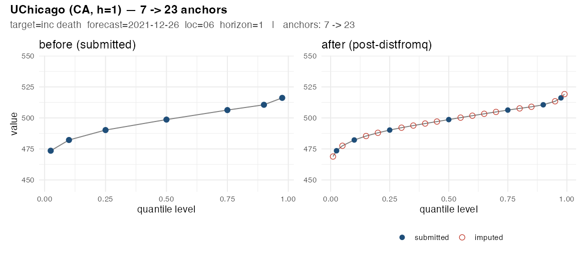
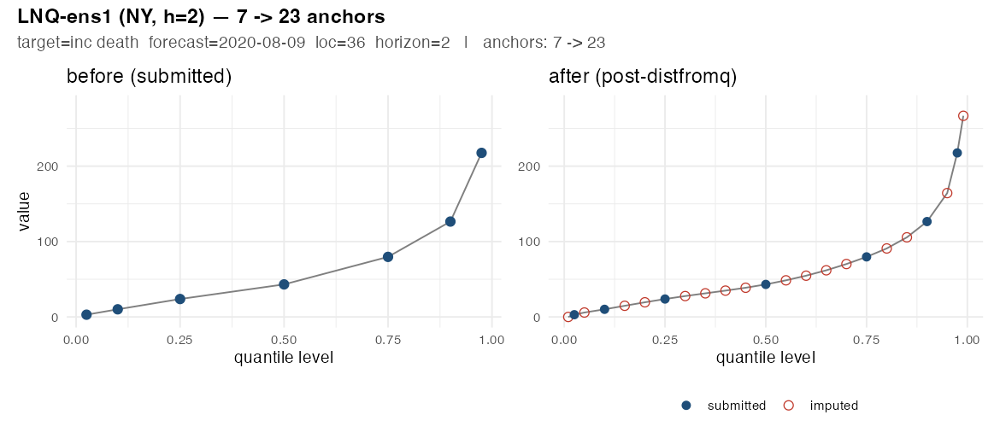
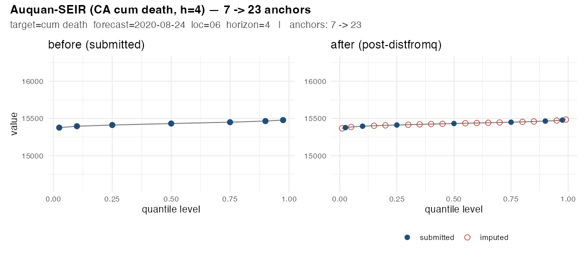
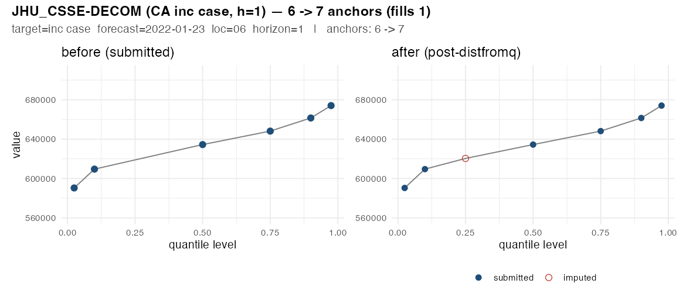
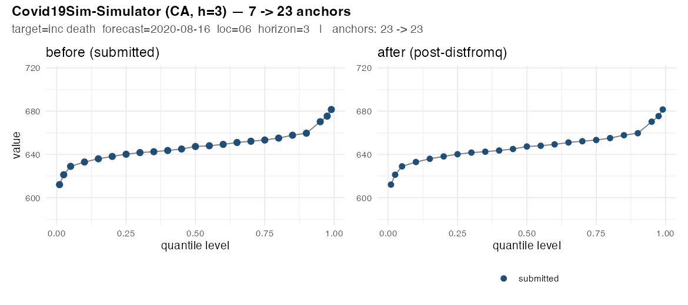
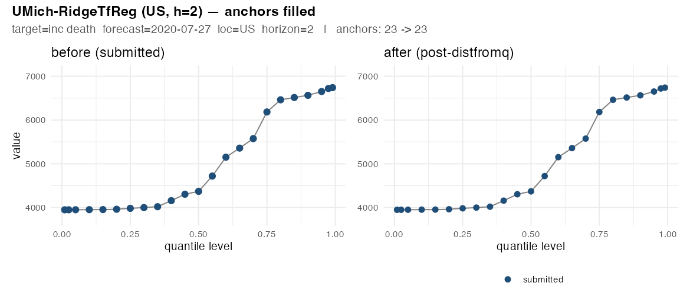

# distfromq imputation: visual examples

These side-by-side plots show how `src/20_distfromq_fill.R` fills in
missing required quantile levels for a representative sample of the 188
incomplete-quantile files. Each panel shows one forecast group 
(`target` × `forecast_date` × `location` × `horizon`):

- **Blue dots** are the levels the team actually submitted ("anchors").
- **Red circles** are levels filled in by `distfromq::make_q_fn` (a
  monotone-spline interpolation on the anchor (probability, value) pairs),
  then isotonically clamped to `[max(0, prev_anchor), next_anchor]`.
- The grey line is the simple piecewise-linear interpolation through the
  sorted points; it is *not* the spline distfromq uses internally, just a
  visual guide to show the shape stays monotone.

If the imputation were introducing artifacts, you would expect red points
off the curve traced by the blue points. In every example below the red
points sit smoothly between the team's submitted anchors, with tail
extrapolations clamped where appropriate.

## Per-cohort outcome summary

The 188 incomplete-quantile files split into 24 (team-model, minimum-anchor-count)
cohorts. The minimum anchor count is the smallest number of distinct quantile
levels found in any `(target, ref_date, location, horizon)` group of the file
— files in a cohort are similar in their submission density. Outcomes:

- **`n_files_with_imputation`** — files where ≥1 group had its missing
  quantile levels filled by `distfromq::make_q_fn`.
- **`n_files_with_group_drops`** — files where ≥1 group had < 5 anchors and
  was dropped (the team's submission for that group is removed; per the
  `src/20` policy explained in `docs/known-validation-issues.md` §5).
- **`n_files_all_quantile_groups_dropped`** — files where every quantile
  group was sparse enough to be dropped. The file is kept (its `mean` and
  `median` rows still validate) but contains no quantile predictions.
- **`n_files_validation_ok_after_fix`** — files that pass
  `hubValidations::validate_submission` after the fix.

| team-model | min&nbsp;anchors | n files | n imputed | n with group drops | n all quantile groups dropped | n validation ok | rows imputed | rows dropped |
|---|---:|---:|---:|---:|---:|---:|---:|---:|
| AIpert-pwllnod | 2 | 3 | 0 | 3 | 3 | 3 | 0 | 7,166 |
| AIpert-pwllnod | 4 | 24 | 0 | 24 | 24 | 24 | 0 | 85,952 |
| Auquan-SEIR | 7 | 5 | 5 | 0 | 0 | 5 | 26,624 | 0 |
| COVIDhub-4_week_ensemble | 3 | 1 | 0 | 1 | 1 | 1 | 0 | 936 |
| COVIDhub-ensemble | 3 | 1 | 0 | 1 | 1 | 1 | 0 | 936 |
| COVIDhub_CDC-ensemble | 3 | 1 | 0 | 1 | 1 | 1 | 0 | 936 |
| Columbia_UNC-SurvCon | 7 | 1 | 1 | 0 | 0 | 1 | 2 | 0 |
| Covid19Sim-Simulator | 7 | 1 | 1 | 0 | 0 | 1 | 895 | 0 |
| CovidActNow-SEIR_CAN | 7 | 1 | 1 | 0 | 0 | 1 | 4,896 | 0 |
| Google_Harvard-CPF | 3 | 1 | 0 | 1 | 1 | 1 | 0 | 4,743 |
| IHME-CurveFit | 2 | 16 | 0 | 16 | 16 | 16 | 0 | 26,274 |
| IowaStateLW-STEM | 2 | 2 | 0 | 2 | 2 | 2 | 0 | 3,564 |
| JHU_CSSE-DECOM | 6 | 2 | 2 | 0 | 0 | 2 | 87 | 0 |
| JHU_UNC_GAS-StatMechPool | 5 | 1 | 1 | 0 | 0 | 1 | 19,368 | 0 |
| JHU_UNC_GAS-StatMechPool | 7 | 2 | 2 | 0 | 0 | 2 | 6,528 | 0 |
| LANL-GrowthRate | 21 | 2 | 2 | 0 | 0 | 2 | 1,378 | 0 |
| LNQ-ens1 | 7 | 29 | 29 | 0 | 0 | 29 | 200,640 | 0 |
| MOBS-GLEAM_COVID | 3 | 1 | 0 | 1 | 1 | 1 | 0 | 540 |
| MOBS-GLEAM_COVID | 7 | 1 | 1 | 0 | 0 | 1 | 5,760 | 0 |
| QJHong-Encounter | 2 | 24 | 0 | 24 | 24 | 24 | 0 | 1,368 |
| QJHong-Encounter | 4 | 2 | 0 | 2 | 2 | 2 | 0 | 88 |
| UChicagoCHATTOPADHYAY-UnIT | 7 | 49 | 49 | 0 | 0 | 49 | 81,536 | 0 |
| UMass-MechBayes | 22 | 2 | 2 | 0 | 0 | 2 | 912 | 0 |
| UMich-RidgeTfReg | 6 | 16 | 16 | 0 | 0 | 16 | 2,928 | 0 |
| **TOTAL** | — | **188** | **112** | **76** | **76** | **188** | **351,554** | **132,503** |

The full per-cohort detail is also in
[`src/logs/distfromq_remediation_summary.csv`](../src/logs/distfromq_remediation_summary.csv).

### Reading the table

A few cohorts to highlight:

- **UChicagoCHATTOPADHYAY-UnIT** (49 files, min=7) — the team submitted 7
  quantile levels per group consistently for the `inc death` rows of every
  file. `distfromq` filled the 16 remaining levels per group in each file
  using the team's own anchors. All 49 files validate after the fix.
- **LNQ-ens1** (29 files, min=7) — same pattern as UChicago: 7 → 23 fill
  on every group. 200,640 imputed rows (largest single-cohort contribution).
- **AIpert-pwllnod** (27 files at min=2 or 4), **IHME-CurveFit** (16, min=2),
  **QJHong-Encounter** (26, min=2 or 4) — these teams submitted with too few
  anchor quantiles (2–4 per group) for `distfromq` to be trusted. Every
  group in each file is dropped. The files remain in the archive but
  contain only `mean` / `median` rows (which still pass validation).
- **JHU_CSSE-DECOM** (2 files, min=6), **LANL-GrowthRate** (2 files, min=21),
  **UMass-MechBayes** (2 files, min=22), **UMich-RidgeTfReg** (16 files,
  min=6) — minor fills: the team already submitted most required levels,
  `distfromq` just topped up the missing tails or middles. The
  JHU_CSSE-DECOM "fills 1 anchor" panel above is an example.
- **Three big-ensemble single-file failures** (COVIDhub-4_week_ensemble,
  COVIDhub-ensemble, COVIDhub_CDC-ensemble at min=3) — these are individual
  ensemble files where one or two contributing teams had sparse data; the
  ensemble inherited it. All three have all groups dropped after the fix.
